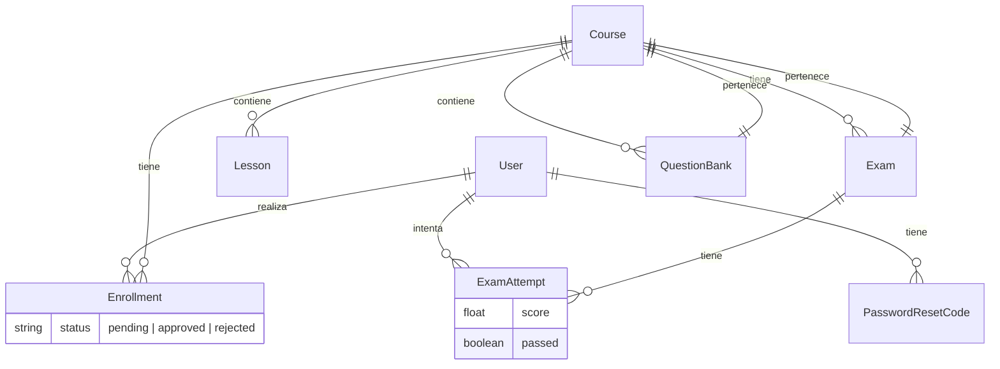

# Documentación del Proyecto - AI Academy

Plataforma Educativa de Ciencia de Datos y Algoritmos

## Índice

1. [Descripción General](#1-descripción-general)
2. [Requisitos del Sistema](#2-requisitos-del-sistema)
3. [Estructura del Proyecto](#3-estructura-del-proyecto)
4. [Modelos de Datos](#4-modelos-de-datos)
5. [Rutas (URLs)](#5-rutas-urls)
6. [Flujo de Navegación Principal](#6-flujo-de-navegación-principal)
7. [Sistema de Autenticación y Recuperación](#7-sistema-de-autenticación-y-recuperación)
8. [Panel de Administración](#8-panel-de-administración)
9. [Demos Interactivas](#9-demos-interactivas)
10. [Sistema de Correos Electrónicos](#10-sistema-de-correos-electrónicos)
11. [Temas y Diseño](#11-temas-y-diseño)
12. [Datos Iniciales (Fixtures)](#12-datos-iniciales-fixtures)
13. [Configuración del Entorno](#13-configuración-del-entorno)
14. [Diagrama de Relaciones entre Modelos](#14-diagrama-de-relaciones-entre-modelos)

---

## 1. Descripción General

AI Academy es una plataforma web interactiva para el aprendizaje de Ciencia de Datos e Inteligencia Artificial. Desarrollada con Django, ofrece cursos autoguiados con teoría, ejemplos prácticos, demos interactivas (Regresión Lineal y Algoritmos Genéticos) y exámenes con calificación automática.

Cuenta con un sistema de usuarios completo: registro con múltiples campos, inicio de sesión, recuperación de contraseña por correo/SMS, perfiles con progreso, y un panel de administración para gestionar inscripciones.

---

## 2. Requisitos del Sistema

- Python 3.10+
- PostgreSQL (opcional, por defecto usa SQLite)
- pip (gestor de paquetes de Python)

Dependencias principales (`requirements.txt`):

| Paquete | Versión | Uso |
|---|---|---|
| Django | 4.2.7 | Framework web |
| django-environ | 0.11.2 | Variables de entorno |
| pandas | >=2.2.0 | Manipulación de datos |
| numpy | >=1.26.0 | Cómputo numérico |
| scikit-learn | >=1.3.2 | Modelos de ML |
| plotly | 5.18.0 | Gráficas interactivas |
| deap | 1.4.1 | Algoritmos genéticos |
| Pillow | >=10.1.0 | Manejo de imágenes |
| psycopg2-binary | >=2.9.9 | Conexión PostgreSQL |
| gunicorn | 23.0.0 | Servidor WSGI producción |

---

## 3. Estructura del Proyecto

```
IA-Academy/
│
├── manage.py                     # Punto de entrada de Django
├── .env                          # Variables de entorno (configuración sensible)
├── .env.example                  # Plantilla del .env
├── requirements.txt              # Dependencias del proyecto
├── README.md                     # Instructivo de instalación
│
├── config/                       # Configuración principal de Django
│   ├── __init__.py
│   ├── asgi.py                   # Servidor ASGI
│   ├── wsgi.py                   # Servidor WSGI
│   ├── urls.py                   # Enrutador principal
│   └── settings/
│       ├── __init__.py
│       ├── base.py               # Configuración base
│       └── production.py         # Configuración para producción
│
├── apps/                         # Aplicaciones Django
│   ├── courses/                  # Módulo de cursos
│   ├── users/                    # Módulo de usuarios
│   ├── exams/                    # Módulo de exámenes
│   ├── genetic_demo/             # Demo de Algoritmo Genético
│   └── regression_demo/          # Demo de Regresión Lineal
│
├── templates/                    # Plantillas HTML
│   ├── base.html                 # Layout base (navbar, footer)
│   ├── courses/                  # 3 plantillas de cursos
│   ├── users/                    # 7 plantillas de usuarios
│   ├── exams/                    # 1 plantilla de examen
│   ├── admin/                    # Plantillas del panel admin
│   ├── emails/                   # 5 plantillas de correos
│   ├── genetic_demo/             # 2 plantillas del GA
│   └── regression_demo/          # 2 plantillas de regresión
│
├── static/                       # Archivos estáticos
│   ├── css/custom.css            # Tema oscuro personalizado (590 líneas)
│   └── js/main.js                # Inicialización de tooltips Bootstrap
│
├── docs/                         # Documentación técnica
│   └── architecture.md           # Este archivo
│
└── fixtures/
    └── courses.json              # Datos iniciales (cursos, lecciones, exámenes)
```

---

## 4. Modelos de Datos

### 4.1 User (`apps/users/models.py`)

Hereda de `AbstractUser`. Campos adicionales:

| Campo | Tipo | Descripción |
|---|---|---|
| `edad` | IntegerField | Nulo |
| `telefono` | CharField(20) | Número de teléfono |
| `genero` | CharField(1) | M, F, O, N |
| `tipo_documento` | CharField(2) | CC, TI, CE, PA, NI |
| `numero_documento` | CharField(30) | Documento de identidad |
| `avatar` | ImageField | Subido a `avatars/` |
| `bio` | TextField(500) | Biografía |
| `courses_completed` | IntegerField | Por defecto 0 |
| `total_score` | FloatField | Por defecto 0.0 |
| `last_activity` | DateTimeField | auto_now |

**Método importante:**
- `update_progress()`: Calcula cuántos cursos ha completado basándose en `ExamAttempt` aprobados.

### 4.2 PasswordResetCode (`apps/users/models.py`)

| Campo | Tipo | Descripción |
|---|---|---|
| `user` | ForeignKey → User | Usuario asociado |
| `code` | CharField(6) | Código de 6 dígitos |
| `created_at` | DateTimeField | Fecha de creación |
| `is_used` | BooleanField | Si ya fue usado |

### 4.3 Course (`apps/courses/models.py`)

| Campo | Tipo | Descripción |
|---|---|---|
| `title` | CharField(200) | Título del curso |
| `slug` | SlugField | Único |
| `description` | TextField | Descripción |
| `objectives` | TextField | Objetivos |
| `prerequisites` | TextField | Opcional |
| `image` | ImageField | Nulo |
| `order` | IntegerField | Por defecto 0 |
| `created_at` | DateTimeField | Fecha de creación |
| `updated_at` | DateTimeField | auto_now |

**Propiedades:**
- `total_lessons`: Número total de lecciones
- `theory_lessons`: Lecciones de tipo 'theory'
- `example_lessons`: Lecciones de tipo 'example'

### 4.4 Lesson (`apps/courses/models.py`)

| Campo | Tipo | Descripción |
|---|---|---|
| `course` | ForeignKey → Course | Curso padre |
| `title` | CharField(200) | Título |
| `lesson_type` | CharField(20) | theory, example, demo, exam |
| `order` | IntegerField | Orden |
| `content` | TextField | Contenido |
| `demo_app` | CharField(50) | regression, genetic, neural, tree, svm, clustering, nlp |
| `created_at` | DateTimeField | Fecha de creación |
| `updated_at` | DateTimeField | auto_now |

### 4.5 Enrollment (`apps/courses/models.py`)

| Campo | Tipo | Descripción |
|---|---|---|
| `user` | ForeignKey → User | Usuario |
| `course` | ForeignKey → Course | Curso |
| `status` | CharField(20) | pending, approved, rejected |
| `created_at` | DateTimeField | Fecha de creación |
| `updated_at` | DateTimeField | auto_now |

**Unique constraint:** `[user, course]` — un usuario una sola inscripción por curso.

### 4.6 QuestionBank (`apps/exams/models.py`)

| Campo | Tipo | Descripción |
|---|---|---|
| `course` | ForeignKey → Course | Curso asociado |
| `question_text` | TextField | Enunciado |
| `question_type` | CharField(20) | multiple_choice, true_false |
| `options` | JSONField | Lista de opciones |
| `correct_answer` | CharField(500) | Respuesta correcta |
| `explanation` | TextField | Opcional |
| `difficulty` | IntegerField | 1: Fácil, 2: Media, 3: Difícil |
| `created_at` | DateTimeField | Fecha de creación |

### 4.7 Exam (`apps/exams/models.py`)

| Campo | Tipo | Descripción |
|---|---|---|
| `course` | ForeignKey → Course | Curso asociado |
| `title` | CharField(200) | Título |
| `description` | TextField | Descripción |
| `passing_score` | IntegerField | Por defecto 70 |
| `questions_count` | IntegerField | Por defecto 10 |
| `time_limit_minutes` | IntegerField | Por defecto 30 |
| `created_at` | DateTimeField | Fecha de creación |

**Método importante:**
- `generate_random_questions()`: Selecciona aleatoriamente N preguntas del `QuestionBank` del curso.

### 4.8 ExamAttempt (`apps/exams/models.py`)

| Campo | Tipo | Descripción |
|---|---|---|
| `user` | ForeignKey → User | Usuario |
| `exam` | ForeignKey → Exam | Examen |
| `questions` | JSONField | Lista de IDs de preguntas |
| `user_answers` | JSONField | Dict de respuestas |
| `score` | FloatField | Nulo |
| `passed` | BooleanField | Si aprobó |
| `started_at` | DateTimeField | Inicio |
| `completed_at` | DateTimeField | Nulo |

**Método importante:**
- `calculate_score()`: Compara respuestas del usuario con las correctas, calcula porcentaje y determina si aprobó. Actualiza el progreso del usuario automáticamente.

---

## 5. Rutas (URLs)

### Módulo courses (prefijo: `/`)

| Ruta | View | Nombre |
|---|---|---|
| `/` | course_list | courses:course_list |
| `/course/<slug>/` | course_detail | courses:course_detail |
| `/course/<slug>/enroll/` | enroll_course | courses:enroll_course |
| `/course/<slug>/lesson/<int>/` | lesson_detail | courses:lesson_detail |

### Módulo users (prefijo: `/users/`)

| Ruta | View | Nombre |
|---|---|---|
| `/users/register/` | register | users:register |
| `/users/login/` | login | users:login |
| `/users/logout/` | logout | users:logout |
| `/users/profile/` | profile | users:profile |
| `/users/admin-panel/` | admin_panel | users:admin_panel |
| `/users/reset-password/` | password_reset_request | users:password_reset_request |
| `/users/reset-password/verify/` | password_reset_verify | users:password_reset_verify |
| `/users/reset-password/confirm/` | password_reset_confirm | users:password_reset_confirm |

### Módulo exams (prefijo: `/exams/`)

| Ruta | View | Nombre |
|---|---|---|
| `/exams/<int>` | start_exam | exams:start_exam |
| `/exams/<int>/submit/` | submit_exam | exams:submit_exam |

### Módulo regression_demo (prefijo: `/regression/`)

| Ruta | View | Nombre |
|---|---|---|
| `/regression/` | index | regression_demo:index |
| `/regression/result/` | result | regression_demo:result |

### Módulo genetic_demo (prefijo: `/genetic/`)

| Ruta | View | Nombre |
|---|---|---|
| `/genetic/` | index | genetic_demo:index |
| `/genetic/result/` | result | genetic_demo:result |

### Admin de Django

| Ruta | Descripción |
|---|---|
| `/admin/` | Django admin estándar |

---

## 6. Flujo de Navegación Principal

1. El usuario llega a la portada (`/`) donde ve la lista de cursos.
2. Al hacer clic en un curso, ve su detalle con lecciones y opción de inscribirse.
3. Para inscribirse debe estar registrado e iniciar sesión.
4. La inscripción queda en estado "pending" hasta que un administrador la apruebe o rechace desde el panel de administración.
5. Una vez aprobado, puede acceder a las lecciones del curso.
6. Al completar el examen del curso, obtiene una calificación y se marca como completado.
7. El usuario puede ver su progreso y exámenes realizados en su perfil.

---

## 7. Sistema de Autenticación y Recuperación

### Registro
- Formulario con campos: usuario, nombres, apellidos, correo, edad, teléfono, género, tipo/número de documento, foto de perfil y contraseña.
- El usuario se crea activo de inmediato.

### Inicio de sesión
- `LoginView` personalizado que valida si el usuario está activo.
- Mensajes de bienvenida usando Django Messages.

### Recuperación de contraseña (3 pasos)
1. **Solicitud**: el usuario ingresa su nombre de usuario.
2. **Verificación**: se envía un código de 6 dígitos por correo y SMS (Twilio). El usuario ingresa el código. Tiene validez de 15 minutos.
3. **Confirmación**: el usuario establece una nueva contraseña.

### Cierre de sesión
- Vista personalizada que muestra mensaje de confirmación.

---

## 8. Panel de Administración

Accesible solo para superusuarios en `/users/admin-panel/`.

**Funcionalidad:**
- Dos pestañas: Pendientes y Aprobados
- Muestra tarjetas de resumen con contadores
- Tablas con buscador en vivo (filtro por cualquier columna)
- Acciones:
  - **Aprobar**: cambia status a 'approved' y envía correo
  - **Rechazar**: elimina la inscripción y envía correo de rechazo

**Columnas en pendientes:** Usuario, Nombres, Apellidos, Correo, Curso, Teléfono, Solicitud (fecha), Acciones (aprobar/rechazar).

**Columnas en aprobados:** Usuario, Nombres, Apellidos, Correo, Curso, Teléfono, Aprobado (fecha).

---

## 9. Demos Interactivas

### 9.1 Regresión Lineal (`/regression/`)

El usuario sube un archivo CSV, selecciona la columna X e Y, y el tamaño de test. El sistema:
- Entrena un modelo de Regresión Lineal con scikit-learn
- Muestra métricas: R², RMSE, MAE
- Genera una gráfica interactiva (Plotly) con la recta de regresión
- Muestra información del dataset (forma, columnas, tipos)

### 9.2 Algoritmo Genético (`/genetic/`)

El usuario configura parámetros:
- Función a optimizar (f(x)=x², f(x)=-(x-2)²+5, o Knapsack)
- Tamaño de población, generaciones, probabilidades de cruza/mutación
- Tipo de selección (tournament, roulette, rank, random)

El sistema ejecuta el GA usando DEAP y muestra:
- Mejor solución encontrada y su valor fitness
- Gráfica interactiva (Plotly) de evolución del fitness por generación

---

## 10. Sistema de Correos Electrónicos

Se envían correos HTML en los siguientes eventos:

| Evento | Template |
|---|---|
| Código de recuperación de contraseña | reset_code.html |
| Inscripción aprobada | enrollment_approved.html |
| Inscripción rechazada | enrollment_rejected.html |
| Cuenta aprobada | approved.html |
| Cuenta rechazada | rejected.html |

Configuración SMTP en `.env` (por defecto usa Gmail). Respaldado por envío SMS vía Twilio para el código de recuperación.

---

## 11. Temas y Diseño

- Bootstrap 5.3.2 para el layout responsivo
- FontAwesome 6.4.0 para íconos
- Tema oscuro personalizado (`static/css/custom.css`) con:
  - Paleta de colores: púrpura (#6C3CE1), cian (#00D4FF), verde (#00FF88)
  - Fondo oscuro (#0A0A1A) con patrón de conexiones neuronales SVG
  - Efectos glassmorphism en tarjetas y menús
  - Animaciones fadeInUp y pulse en elementos
  - Hover con glow y transformaciones en tarjetas y botones
  - Scrollbar personalizado

---

## 12. Datos Iniciales (Fixtures)

El archivo `fixtures/courses.json` contiene datos de demostración:

- 2 cursos: "Regresión Lineal" y "Algoritmos Genéticos"
- 6 lecciones distribuidas entre teoría, ejemplo, demo y examen
- 2 exámenes (uno por curso)
- 20 preguntas en el banco (opción múltiple y verdadero/falso)

Para cargar los datos:
```bash
python manage.py loaddata fixtures/courses.json
```

---

## 13. Configuración del Entorno

Variables de entorno (archivo `.env`):

| Variable | Descripción | Ejemplo |
|---|---|---|
| `DEBUG` | Modo depuración | `True` |
| `SECRET_KEY` | Clave secreta de Django | `<clave-secreta>` |
| `DATABASE_URL` | URL de base de datos | `sqlite:///db.sqlite3` |
| `EMAIL_BACKEND` | Backend de correo | `django.core.mail.backends.smtp.EmailBackend` |
| `EMAIL_HOST` | Servidor SMTP | `smtp.gmail.com` |
| `EMAIL_PORT` | Puerto SMTP | `587` |
| `EMAIL_USE_TLS` | Usar TLS | `True` |
| `EMAIL_HOST_USER` | Usuario de correo | `<correo>` |
| `EMAIL_HOST_PASSWORD` | Contraseña de aplicación | `<contraseña-app>` |
| `DEFAULT_FROM_EMAIL` | Remitente por defecto | `<correo-remitente>` |
| `TWILIO_ACCOUNT_SID` | SID de Twilio | `<sid>` |
| `TWILIO_AUTH_TOKEN` | Token de Twilio | `<token>` |
| `TWILIO_FROM_NUMBER` | Número de Twilio | `<numero-twilio>` |

---

## 14. Diagrama de Relaciones entre Modelos


